Create a custom workflow to create a simple Load Balancing configuration
========================================================================

You will learn how to create a custom Workflow to complete the following: 
-	Create a Pool 
-	Add members to the new Pool 
-	Create a VIP 
-	Enable SNAT the VIP 

Process Tip
-----------
During the following workflow you may save and exit at some point . The Create Workflow in this exercise assumes you stay in the Edit mode for the entire process. In the event that you exit the edit mode it is a simple task to get back to it
-	Select the Workflow you wish to edit
-	Select the schema tab
-	Select the pencil icon
-	Expand the tabs as needed to return to your work

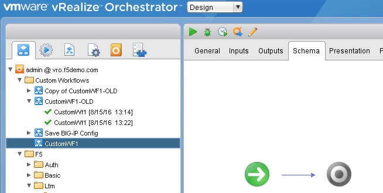

Create a CustomWorkflows Folder
---------------------------------
Note: This step has been completed. Sample workflows are in the folder	

Right click on the admin@vro.f5demo.com container. 
-	Choose Add Folder. 
-	Enter CustomWorkflows in the Name field
-	click Ok. 

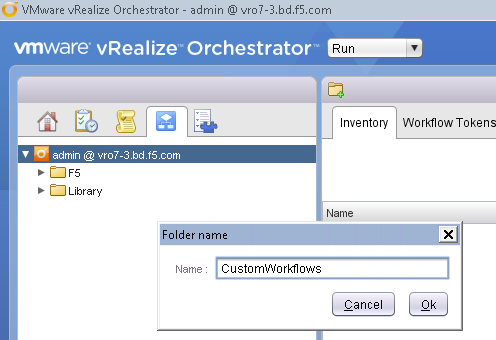

Create a Custom Workflow 
--------------------------
Right click on the CustomWorkflows folder 
-	Choose New Workflow 
-	Enter CustomWF1 
-	Choose OK
-	Select Save  

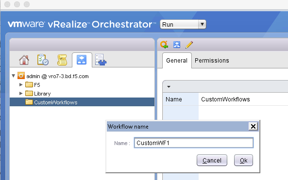
  
  
Create Pool and add it to Custom Workflow	
------------------------------------
Select the Schema Tab
Expand the All Workflows heading on the left and navigate to F5/Ltm/Pool 

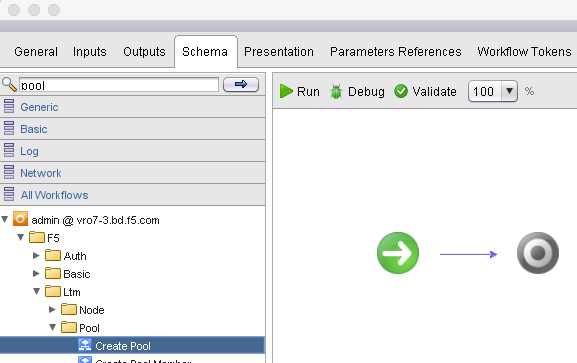
   
Choose the Setup button in the upper right(This will bring up the Promote Workflow 
Input Parameters)

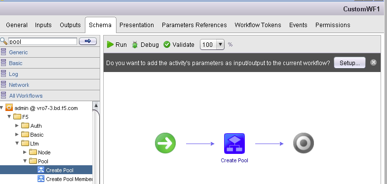
  
  
Choose Skip in the **Reset all binding to: section**

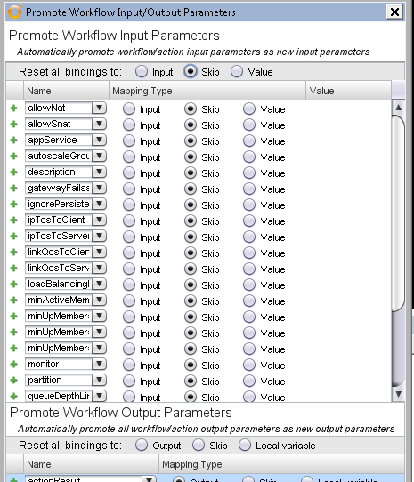
   

*Choose Value for loadBalancingMode and enter round-robin  (This will be the default load balancing algorithm used)* 
*Choose Value for partition and enter Common  (This will force all objects created by CustomWF1 to be put in the Common partition)* 
 
Select Input for monitor, name and bigip  (scroll down for the last 2) :

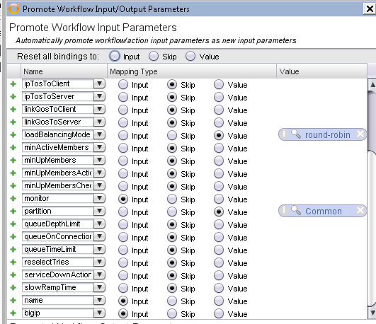
      
      
Choose **Promote** > **Save** 
 

Modify presentation layer of custom workflow	
--------------------------------------------
Choose the Green Run triangle to start your workflow 

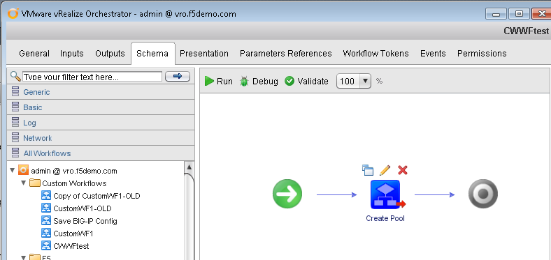

You see the 3 parameters that we set to input appear as input parameters. 

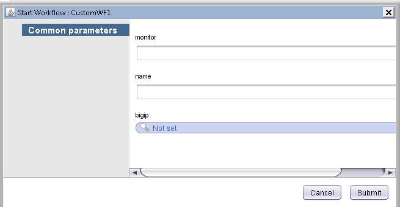
Choose **Cancel**

Choose the General tab
You see the loadBalancingmode and partition set to the values we defined define. (view the full screen)

Choose the Presentation tab(Each variable is shown with 3 parameters (type)name description)

Choose monitor and enter Monitor to be used by LTM Pool in the description. 

Choose name and enter Name for LTM objects created by this WF  name for the description. 
 
Choose bigip and enter BigIP to be configured in the description field.

Reorder the variables so they appear in this order: bigip, name, and monitor(You can rearrange the variable order by dragging and dropping the variable names.) 

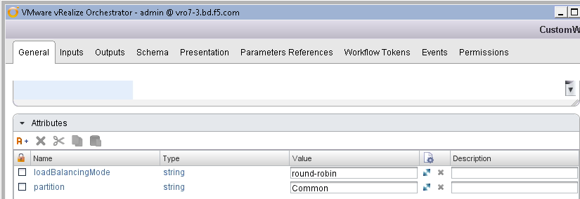
Choose the Schema tab 

Mouse over the Create Pool workflow on the Schema tab
 
Choose the Pencil icon above the Create Pool workflow
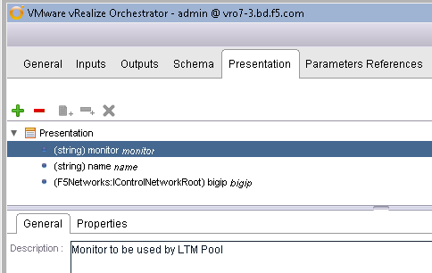

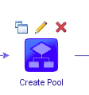
Choose the OUT tab 
 
Double Click the actionResult [out-parameter] under Source parameter 
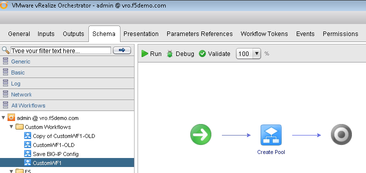

Choose the Create parameter/attribute in workflow link 

 
 Enter **F5Pool** in the Name field (This will create an **F5Pool** output variable that references the pool that has just been created)
 .. image:: ../images/image037.png
   :scale: 25 %
   :align: center  
Choose Ok > Close > Save 

Choose the Green Run triangle 
 .. image:: ../images/image038.png
   :scale: 25 %
   :align: center  

The order and description of the input parameters has been updated.
 .. image:: ../images/image039.png
   :scale: 25 %
   :align: center 
Choose **Cancel** 

Add the created Pool Member workflow to the custom workflow
----------------------------------------------------------
Expand the All Workflows heading on the left and navigate to F5/Ltm/Pool 
 
Drag and drop the Create Pool Member workflow to the right of the Create Pool workflow 

Choose Setup in the upper right
 .. image:: ../images/image040.png
   :scale: 25 %
   :align: center 

Choose **Skip** in the Reset all binding to: section 
 
Chose Input for **address** and **port**(This will add the address and port fields to the presentation layer) 
 
Enter **lamp11** as the value for node (..This is the pool member object you created as part of the Create Pool Member workflow earlier..) 

 .. image:: ../images/image041.png
   :scale: 25 %
   :align: center 
 Choose **Promote**   

Mouse over the Create Pool Member workflow 
 
Choose the Pencil icon to edit 
 .. image:: ../images/image042.png
   :scale: 25 %
   :align: center   
Choose the **IN** tab 
 
Double click the **NULL Source parameter** next to the bigip Local Parameter 
 
Choose the **bigip in-parameter** 
 
Choose **Select** 
 
Repeat steps for the following parameters: 
 pool:F5Pool 
 partition:partition 

 .. image:: ../images/image043.png
   :scale: 25 %
   :align: center   
Choose **Close** > **Save**

Add the Create Virtual Server workflow to the custom workflow	
-------------------------------------------------------------
** Be sure you are in the Schema tab **

Expand the All Workflows heading on the left and navigate to F5/Ltm/Virtual Server 
 
Drag and drop the Create Vitual Server workflow to the right of Create Pool Member on the Schema tab 
 .. image:: ../images/image038.png
   :scale: 25 %
   :align: center 

 
